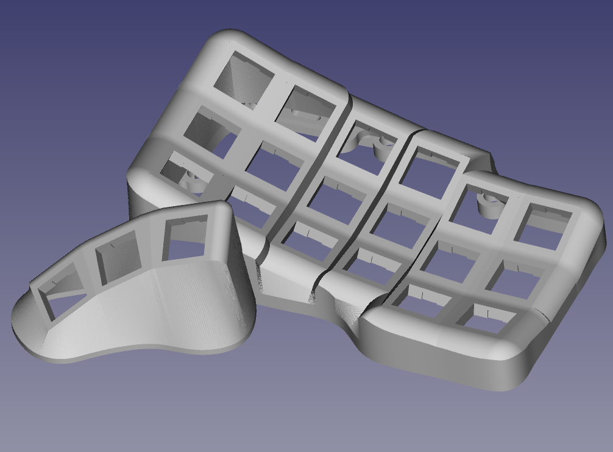
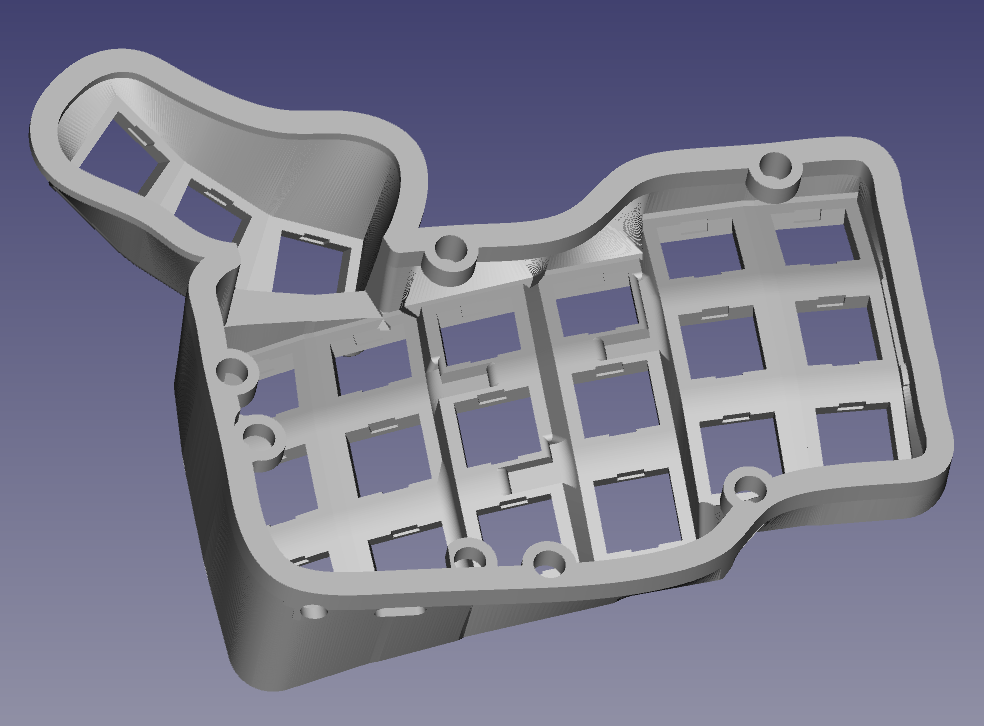
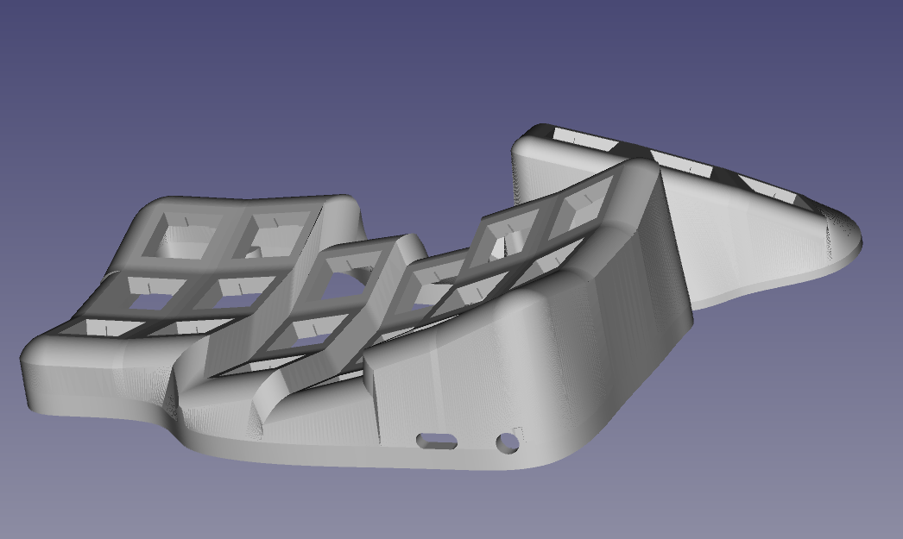

##  Ergosplit-3x6
Корпус для эргономичной клавиатуры. 18 основных клавиш и 3 вспомогательных для большого пальца.

#### Предупреждение
На данный момент клавиатура находить на стадии разработки и пока что готовы только корпусы. Данные корпуса полностью совместимы с клавиатурами [Bastardkb](https://github.com/Bastardkb), поэтому для сборки подходят их платы и прошивки, совместимые с данным проектом.
## Печать
Модель довольно сложная для печати, так как имеется огромное колличество нависающих элементов, от которых невозможно избавиться.

Перед печатью рекомендуется проверить настройки поддержек.
